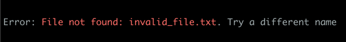
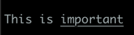
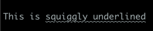

# ANSIe - Go library for ANSI colours in terminal

This library API is inspired by [jansi library](https://github.com/fusesource/jansi).

## Usage

Get the library:

    go get github.com/uaraven/ansie

You will need Go 1.23 or higher to use it.

`ansie` supports basic 7-colour, 256 colour and true colour modes. You can also use various attributes, such as underline, strike-out, etc.

Simple coloured output:

```go
import . "github.com/uaraven/ansie"

errorMsg := Ansi.A("Error: ").Fg(Red).S("File not found: %s", fileName).Reset().A("Try a different name").String()
```



Underlined text:
```go
import . "github.com/uaraven/ansie"

errorMsg := Ansi.A("This is ").Attr(Underline).A("important").String()
```


Custom ANSI attributes
```go
import . "github.com/uaraven/ansie"

fmt.Printf(Ansi.A("This is ").Esc('m', ':', 4, 3).A("squiggly underlined").CR().String())
```


Disable colour if output is being redirected to file:

```go
import . "github.com/uaraven/ansie"

a := NewAnsiFor(os.stdout)

errorMsg := a.A("Error: ").Fg(Red).S("File not found: %s", fileName).Reset().A("Try a different name").String()
```

## Compatibility

### Basic colours

`ansie` supports basic terminal colours: Black, Red, Green, Yellow, Blue, Magenta, Cyan and White.
These colours should be compatible with all terminals of the last 30 years.

Use `AnsiBuffer.Fg()` and `AnsiBuffer.Bg()` to set these colours.

### 256 colours

Extended colours, like `BrightBlue`, `Teal`, `Fuchsia` or `LightGoldenrod3` will use 256-colour ANSI sequences and should also 
work with any terminal of the last 30 years.

Use `AnsiBuffer.Fg()` and `AnsiBuffer.Bg()` to set these colours.

216 colours of the Xterm palette can be set using RGB values, where each colour component is limited to the values from
0 to 5 (inclusive), forming a 6x6x6 colour cube.
Use following functions to set 6-value component colours: `AnsiBuffer.FgRgb6(r,g,b uint)` and `AnsiBuffer.BgRgb6(r,g,b uint)`

Shade of gray colours can be set for foreground and background using intensity values.

One can use integer values from 0 to 23 which directly map to grayscale palette indices from 232 to 255.
Use methods `AnsiBuffer.FgGray(uint)` and `AnsiBuffer.BgGray(uint)` to set grayscale colour by integer index.

Alternatively one can use floating point intensity value in the range from 0 to 1, it will be automatically mapped
to one of the closest 24 grayscale colours.

Use methods  `AnsiBuffer.FgGrayF(float64)` and `AnsiBuffer.BgGrayF(float64)`.


### "True colour"

`ansie` supports full 24-bit colours using RGB values, which should be supported by all modern terminals, but it isn't. 
Standard MacOS terminal, for example, doesn't support 24 bit color 
Use following functions to set 24-bit colours: `AnsiBuffer.FgRgb(r,g,b int)`, `AnsiBuffer.FgRgbI(rgb int)`, `AnsiBuffer.BgRgb(r,g,b int)` and `AnsiBuffer.BgRgbI(rgb int)`

To use 24-bit colours on terminals that do not support 256-colour mode, you can convert 24-bit colour to 256-colour palette
using the Rgb6x6x6 function. This function will map RGB values to the closest 256-colour index, including grayscale.

```go
    color256 := ansie.Rgb6x6x6(255, 128, 64) // Converts RGB to 256-colour index
```

### True colour compatibility mode

To use 24-bit colours on terminals that do not support 256-colour mode, you can enable compatibility mode.

Compatibility mode works by writing two sequences to the terminal: one for 256-colour mode and another for true colour.
If terminal supports true colour, then true colour sequence will override 256-colour sequence, otherwise it will be ignored.

Colour compatibility mode is disabled by default, but you can enable it by setting `ColorCompatibility` field of `AnsiBuffer` to `true`.

```go
import . "github.com/uaraven/ansie"
a := NewAnsiFor(os.Stdout)
a.ColorCompatibility = true // Enable compatibility mode
a.FgRgb(255, 128, 64).A("This text will be in true colour").Reset().CR().Print()
```

`FgRgb()`, `FgRgbI()`, `BgRgb()` and `BgRgbI()` methods support compatibility mode.

### Colour names

`ansie` defines constants for the 256-colour palette with the names taken from [here](https://www.ditig.com/256-colors-cheat-sheet) and
matching Xterm names.

Note that some of the Xterm colour names are duplicated with the different palette index value. In the case of duplicates
one random name was selected and added to `ansie` constants.
                     

## Terminal manipulation

`ansie` provides a basic terminal manipulation API, which allows you to read terminal size, move the cursor, clear the screen.
You can use `Screen` struct to manipulate the terminal.

```go
import . "github.com/uaraven/ansie"

screen, err := NewScreen() // Create a new screen for stdout
if err != nil {
    panic(err) // Handle error if screen creation fails
}
defer screen.Close() // Ensure the screen is closed when done
screen.Clear() // Clear the screen
screen.MoveCursorTo(10, 20) // Move cursor to line 10, column 20
fmt.Println(Ansi.FgRgb(255,255,255).A("Hello, world!").Reset().String()) // Print text at the new cursor position
```
                                                
When creating a new `Screen`, it will automatically switch to an alternative buffer, which allows you to manipulate the terminal without affecting the current output.
You must use `Screen.Close()` to return to the main buffer and restore the terminal state.

Raw mode is not enabled by default, but you can enable it with `Screen.SetRawMode(true)`.

`Screen` struct is in beta state and may change in the future. It is not recommended to use it in production code yet.

Terminal manipulation API is not supported on Windows.

## License

`ansie` is distributed under the terms of MIT license.

Copy of the license text is available in the [license.txt](license.txt) file.
